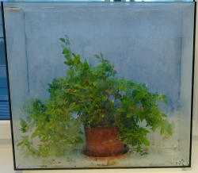
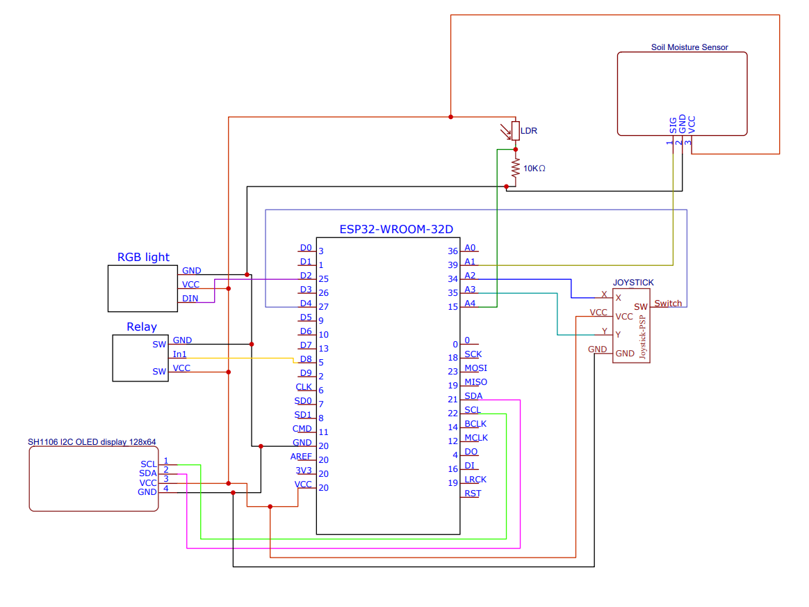
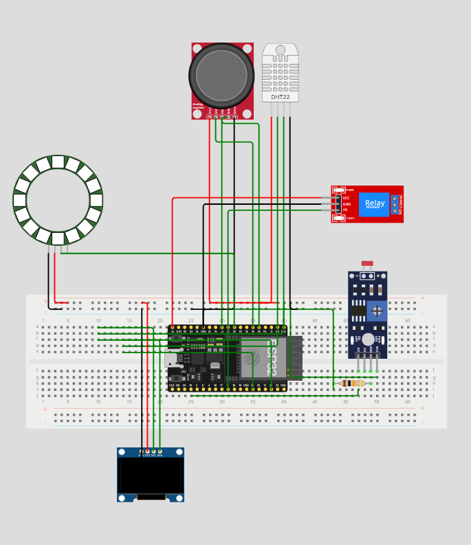

# Tropical-Plants
  **Project descrption:** The goal of the project is to create a system that measures key environmental parameters (such as temperature, humidity, light levels, soil moisture) for tropical plants. This system should also allow the user to control or adjust environmental conditions and visualize the data.

     

  
 
## Team members
  Joritz Legarda-Ereño Aranguren
  
  June Lizaso Aguirre
  
  Laura Prior Urbizu
  
  Joseba Sagarzazu Oteiza
## Hardware descrption
This are all the hardaware components used in this project:
- Joystick
- RGB lights
- MicroPython OLED display
- BreadBoard
- ESP32 WROOM 32D
- Light dependance resistance (LDR)
- Relay
- Soil Moisture Sensor

We have made a research on each hardware component that we have implemented in this project.

### Joystick:

The fundamental concept behind the analog joystick involves two linked potentiometers that convey data on **vertical (Y-axis) and horizontal (X-axis) motion**. Furthermore, the joystick is equipped with a select button that **works like a switch.**

Joystick consist on 5 pins. `VCC` and `GND` are connected to the corresponding pins in the breadboard. 

There are other two pins, in this case **analog pins**, that control X and Y axis movement, `Vrx` and `Vry` respectively. In the case of X axis, this pin is connected to `PIN34` (A2) of the microcontroller, whereas Y axis is connected to `PIN35` (A3). 

The last pin is a **digital** one and works like a switch when de joystick is pressed. This one is connected to `PIN27` (D4).

The analog values are shown on the picture below:

 

In this case analog values are computed between **0 and 1023**.

### RGB light:
**Used Model:** `RGB LED strip Neopixel WS2812B`

A LED strip is a flexible circuit board that contains a series of small Light Emitting Diodes (LEDs) mounted along its length. 

This model has three pins.`VCC` and `GND` are connected to the corresponding pins in the breadboard. The third PIN is called DINPIN, this digital pin i connected to `PIN25` (D2) and controls the signals.

RGB LEDs combine red, green, and blue LEDs in one unit. By adjusting the brightness of each color, they can produce a wide range of colors through additive color mixing.

### MicroPython OLED display:
**Used Model:** `SH1106 I2C OLED display 128x64`

An OLED display in the context of MicroPython is a small screen that uses Organic Light Emitting Diode technology, controlled using the MicroPython programming language.

It uses OLED (Organic Light Emitting Diode) technology paired with an `I2C` (Inter-Integrated Circuit) communication interface. The `I2C` interface streamlines the connection between the display and a microcontroller, making it simpler to control and incorporate into different electronic projects.

It consist on 4 pins. `VCC` and `GND` are connected to the corresponding pins in the breadboard, in the same way as SDA and SCL pins, `PIN21` and `PIN22` respectively. 

### Breadboard:
A breadboard is a flat, perforated board that allows components and wires to be **easily inserted and connected** for building and testing electronic circuits.

A breadboard has **rows and columns of holes**, with the holes in the same row connected electrically. The rows are typically connected horizontally, while the columns are for positioning components. By inserting components into these holes, electrical connections are made between the holes in the same row, allowing components to interact without soldering.

### ESP32 WROOM 32D:

The ESP32 is a microcontroller developed by Espressif Systems that integrates Wi-Fi and Bluetooth connectivity. It is designed for use in a wide range of Internet of Things (IoT) applications due to its powerful processing capabilities, low power consumption, and versatile features.

The ESP32 microcontroller board offers multiple GPIO (General Purpose Input/Output) pins that serve various functions. These pins can be configured for tasks such as digital input/output, reading analog signals, supporting communication protocols like UART, SPI, and I2C, generating PWM (Pulse Width Modulation) signals, and more. These versatile pins allow the ESP32 to interact with sensors, actuators, displays, and other external components, making it suitable for a wide range of applications.

All these GPIO pins can be observed in the picture above.

### Light dependance resistance (LDR):
An LDR (Light Dependent Resistor) is a type of resistor whose resistance decreases as the light intensity falling on it increases. In darkness, the resistance of an LDR is high, while in bright light, its resistance is low. This property allows LDRs to be used in light-sensitive applications.

LDR has two terminals one of them is connected to `GND` with a 10kΩ resistor and in the same row of the breadboard this terminal is connected to the analog pin `PIN15` (A4), whereas the other terminal is connected to `VCC`.

In this case analog values are computed between **0 and 255**.

### Relay:
A relay is an electrically operated switch that allows a low-power signal to control a higher-power circuit.

A relay works by using an electromagnet to control a set of contacts. When a small current flows through the electromagnet, it creates a magnetic field that moves the contacts, either opening or closing the circuit. This allows a low-power signal to control a higher-power circuit.

The relay consist on 3 pins. `VCC` and `GND` are connected to the corresponding pins in the breadboard. The other pin is a digital PIN where is connected to `PIN5` (D8).

### Soil moisture sensor:
**Used model:** `Moisture sensor v1.2`

A soil moisture sensor is a device used to measure the amount of water present in the soil. It helps monitor soil conditions, providing real-time data on moisture levels.

The Soil Moisture V1.2 sensor is a commonly used, low-cost, analog soil moisture sensor that works by measuring the soil's moisture content based on its electrical resistance. It uses two metal probes to measure soil moisture. When the soil is wet, it conducts electricity better due to dissolved salts in the water, resulting in lower resistance. When the soil is dry, the resistance increases because there's less water to conduct electricity.

The moisture sensor consist on 3 pins. `VCC` and `GND` are connected to the corresponding pins in the breadboard. The other pin is a digital PIN where is connected to `PIN39` (A1).

### Circuit Diagram:
In the following diagram of the complete circuit, all hardware components and their corresponding connections are illustrated:

This is a simulation of the physical connection:

## Software description:
### Flowcharts:
Flowchart of the main functioning of the project.

Flowchart of the function that displays the menu to choose the appropiate clima for the plant.

Flowchart to choose the parameters to change.

FLowchart corresponding to the function that allows the user to modify the humidity.

Flowchart corresponding to the function that allows the user to modify the light.

### Used MODULES:

- **Time:**
The time module in Python provides various time-related functions to work with the current time, pause execution, and measure time intervals. It is built-in and doesn't require any installation. Most used function in time module is `time.sleep`, with this function is possible to adjust the time we need the program to be waiting.

- **Machine:**
The machine module in Python is primarily used for interacting with hardware on microcontrollers and other embedded systems. This module provides control over hardware-specific functionalities such as GPIO pins, I2C, SPI, PWM, ADC, and more.
We have used the following common classes and functions:
   - **Timer:** Timer class allows you to set up hardware timers to run functions after specified delays or at regular intervals.
   - **ADC:** The ADC (Analog-to-Digital Converter) in the machine module of MicroPython allows you to read analog voltages from a pin and convert them into a digital value. It provides a method      read() to obtain the digital representation of the input voltage, typically in the range of 0 to 4095.
   - **I2C:** The I2C class in the machine module allows communication between a microcontroller and I2C devices using the I2C protocol.
   - **Pin:** The Pin class in the machine module represents a GPIO pin on the microcontroller. It allows you to configure and control the state of pins.
   - **Math:** The math module in Python provides access to mathematical functions defined by the C standard library. It includes functions for arithmetic, trigonometry, logarithmic calculations,     and more.
      
    
- **sh1106**
   - **SH1106_I2C:** A driver class in MicroPython used to interface with SH1106-based OLED displays via the I2C protocol. The SH1106 is a monochrome OLED display controller chip, often used in       small OLED screens.
  
- **dht12**
  - **DHT12:** The DHT12 module is a sensor used to measure temperature and humidity. It offers better accuracy and I2C communication, making it easier to interface with microcontrollers.
    Key Features of DHT12 are the following one:
        Temperature Range: -20°C to 60°C with ±0.5°C accuracy.
        Humidity Range: 20% to 95% RH with ±5% accuracy.
        Communication: Supports both I2C and 1-Wire interfaces.
        Power Supply: Operates at 3.3V or 5V.
        I2C Address: Default address is 0x5C.
- **neopixel:** The neopixel module in Python is used to control NeoPixel LED strips or rings, which are RGB LEDs with an integrated controller. It is typically used to create dynamic lighting effects.
  

## Instructions and photos:
Initially, the readings from the DH12 sensor (temperature and humidity), Soil Moisture Sensor v1.2, and LDR (light sensor) are displayed on the OLED screen.

Subsequently, the user is prompted to select one of three available climates suitable for tropical plants. These climates correspond to real-world values from different tropical environments: Savannah, Monsoon, and Rainforest climates. The selection is made using the joystick, following instructions displayed on the OLED screen.

Once a specific climate is selected, its parameters will be displayed on the OLED display.

Once a climate is selected, the measured values and the selected climate parameters are displayed. The system then gradually adjusts the environmental conditions to match the desired parameters. For humidity adjustment, a relay simulates the operation of a fog dispenser. Simultaneously, an RGB light strip automatically adjusts to provide the required light intensity.
)

After this adjustment phase, the user is given the option to either fine-tune the climate parameters for greater accuracy or retain the previously selected values.

If the user opts to retain the selected parameters: The system assumes the settings are optinal and after the values of final parameters are displayed, the message “Plant growing!” on the OLED screen is shown so as to finalize the program.

If the user chooses to further adjust parameters: A new menu is displayed. Using the joystick and following on-screen instructions, the user can modify humidity, light intensity, or both.

Vertical joystick movements adjust light intensity, while horizontal movements adjust humidity. The relay will activate during any humidity adjustment.

Once the user finalizes the adjustments, values of final parameters are displayed on the OLED.

The system confirms the settings by displaying “Plant growing!” on the OLED screen, and the program concludes.

Video of the project:

## References and tools:
These are all the references that were used in this project:

**TOOLS:**

[Wokwi simulator](https://wokwi.com/)

[EasyEDA](https://easyeda.com/)

**REFERENCES:**

[Analog reading](https://randomnerdtutorials.com/esp32-esp8266-analog-readings-micropython/)

[Joystick](https://newbiely.com/tutorials/raspberry-pi/raspberry-pi-joystick)

[LDR](https://www.prateeks.in/2022/09/esp32-interfacing-with-ldr-sensor.html)

[RGB light](https://esp32io.com/tutorials/esp32-ws2812b-led-strip)

[Configuration RelayMode - Python](https://www.upesy.com/blogs/tutorials/esp32-relay-module-with-micropython-code?srsltid=AfmBOop7Rz4NttnxwDSwEVrj7ANNDrtH8H_BS9dAkLuB1RZGA2uLwb5F)

[Moisture sensor](https://srituhobby.com/capacitive-soil-moisture-sensor-v1-2-arduino-code/?srsltid=AfmBOooFLAZaICT7MhLFokFGB1S75tuObefbTCgONZ3T9ZIMaAz51xlr)

